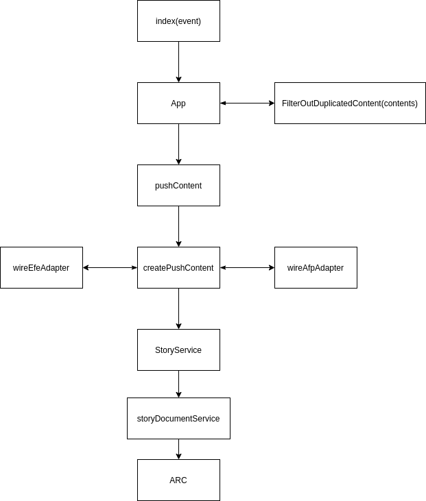

# inbound-wires
AWS serveless application which feeds wire content into Arc's ecosystem.

<!-- START doctoc generated TOC please keep comment here to allow auto update -->
<!-- DON'T EDIT THIS SECTION, INSTEAD RE-RUN doctoc TO UPDATE -->
**Table of Contents**

- [Architecture diagram](#architecture-diagram)
- [Repository](#repository)
- [Setting up the development environment](#setting-up-the-development-environment)
  - [Requisites](#requisites)
    - [Install make](#install-make)
    - [Install AWS SAM CLI](#install-aws-sam-cli)
    - [Install Node.js 12.x](#install-nodejs-12x)
  - [Deploy your own full SAM app to AWS](#deploy-your-own-full-sam-app-to-aws)
    - [Create parameter_overrides from sample](#create-parameter_overrides-from-sample)
    - [Deploy SAM app](#deploy-sam-app)
  - [Use the SAM CLI to build and test locally](#use-the-sam-cli-to-build-and-test-locally)
    - [Setting up local environment variables for dynamically created AWS resources](#setting-up-local-environment-variables-for-dynamically-created-aws-resources)
    - [Test locally](#test-locally)
- [Wire configuration](#wire-configuration)
  - [Wire event JSON Schema](#wire-event-json-schema)
  - [Event examples](#event-examples)
    - [Agencia EFE](#agencia-efe)
    - [AFP](#afp)
- [Environment variables](#environment-variables)
- [Docker image artear/inbound-wires-sam-cli for CI/CD](#docker-image-artearinbound-wires-sam-cli-for-cicd)
  - [Building and pushing the image to Docker Hub account (artear)](#building-and-pushing-the-image-to-docker-hub-account-artear)
- [IDE and IDE Toolkits](#ide-and-ide-toolkits)
  - [Code styling configuration (EditorConfig)](#code-styling-configuration-editorconfig)
- [Background](#background)
- [News wires](#news-wires)
- [Resources](#resources)

<!-- END doctoc generated TOC please keep comment here to allow auto update -->

## Architecture diagram


## FetchFunction diagram


## PushFunction diagram




## RenewTokenFunction diagram


## Repository
This project contains source code and supporting files for a serverless
application that you can deploy with the SAM CLI. It includes the following
files and folders.

- src - Code for the application's Lambda functions
- events - Invocation events that you can use to invoke functions
- template.yaml - A template that defines the application's AWS resources
- resources - Miscellaneous assets indirectly related to this SAM application

## Setting up the development environment
The development environment comprises a full serverless application deployed
in AWS and a local emulation of the AWS Lambda service which runs the code of
the lambda functions which interact with the resources of the remote AWS SAM
application. This forms a hybrid development environment set-up.

### Requisites

* [make](https://www.gnu.org/software/make/)
* [Docker](https://docs.docker.com/get-docker/)
* [AWS SAM CLI](#install-aws-sam-cli)
* [Node.js 12.x](#install-nodejs-12x), including the NPM package management tool.

#### Install make
You may have `make` already installed in your system. You may check it by:

```bash
$ make --version
#GNU Make 4.1
#Built for x86_64-pc-linux-gnu
#Copyright (C) 1988-2014 Free Software Foundation, Inc.
#License GPLv3+: GNU GPL version 3 or later <http://gnu.org/licenses/gpl.html>
#This is free software: you are free to change and redistribute it.
#There is NO WARRANTY, to the extent permitted by law.
```

If you don't, you may install it by using your distro's package management system, e.g. on Ubuntu:

```bash
$ sudo apt install make
```

#### Install AWS SAM CLI

To use the SAM CLI, you should follow the installation instructions by choosing
your OS at the following link:
- [Install the SAM CLI](https://docs.aws.amazon.com/serverless-application-model/latest/developerguide/serverless-sam-cli-install.html)

Here's the link for GNU/Linux OS:
- [Installing the AWS SAM CLI on Linux](https://docs.aws.amazon.com/serverless-application-model/latest/developerguide/serverless-sam-cli-install-linux.html)

#### Install Node.js 12.x
If you don't have `node` installed in your system:
* [Install Node.js 12.x](https://nodejs.org/en/), including the NPM package management tool

Otherwise, you may choose to use the [Node Version Manager](https://github.com/nvm-sh/nvm) to
install Node.js 12.x, without having to uninstall your system's default version:
* [Install `nvm`](https://github.com/nvm-sh/nvm#installing-and-updating) _**(recommended)**_

### Deploy your own full SAM app to AWS
This should make available a fully functional serverless application on your
AWS account. This application is not different from the one deployed in
a production environment except for some configuration values used as
environment variables.

#### Create parameter_overrides from sample
A `parameter_overrides` file contains SAM template parameters as key-value pairs
which represents external configuration values for the application.
Copy the [resources/parameter_overrides-sample](resources/parameter_overrides-sample)
file as `resources/parameter_overrides` and fill in the missing values.
This file is passed as an argument to different `sam` subcommands.

#### Deploy SAM app
You should be able to deploy the current SAM application to AWS:

```bash
$ make stack-deploy
```

The first time you do this, you'll be prompted to fill in many values as part
of a guided deployment. Most of them should be accepted with their default
value (by pressing `Enter`), except for the following:

```
Setting default arguments for 'sam deploy'
=========================================
Stack Name [sam-app]: inbound-wires-<your-username>
...
#Shows you resources changes to be deployed and require a 'Y' to initiate deploy
Confirm changes before deploy [y/N]: y
#SAM needs permission to be able to create roles to connect to the resources in your template
Allow SAM CLI IAM role creation [Y/n]: y
Save arguments to configuration file [Y/n]: y
...
```

After setting these arguments, a Cloudformation stack changeset will be created
and you'll be prompted for changeset deployment:

```
Previewing CloudFormation changeset before deployment
======================================================
Deploy this changeset? [y/N]: y
```

You should see the following message if deployment has been successful:

```
Successfully created/updated stack - inbound-wires-<your-username> in us-east-1
```

You should find the application at [AWS Lambda - Applications](https://console.aws.amazon.com/lambda/home?region=us-east-1#/applications)

### Use the SAM CLI to build and test locally
The Serverless Application Model Command Line Interface (SAM CLI) is an
extension of the AWS CLI that adds functionality for building and testing
Lambda applications. It uses Docker to run your functions in an Amazon Linux
environment that matches Lambda. It can also emulate your application's build
environment and API.

#### Setting up local environment variables for dynamically created AWS resources
An `env.json` file is needed for the local emulation of the Lambda service.
This file has configuration values from AWS resources created dynamically on
application deployment. These values cannot be passed as template parameters
as they are not known before their creation.

Copy the file found at [resources/env-sample.json](resources/env-sample.json)
as `env.json` into the project's root directory.

```bash
inbound-wires$ cp resources/env-sample.json ./env.json
```

You should be able to fill in the environment values manually in `env.json` by
getting them through `make` targets:

- **AWS_QUEUE_URL**
```bash
inbound-wires$ make queue-url
# Example output: https://sqs.<aws-region>.amazonaws.com/206067452611/<your-stack-name>-SqsQueue-HASH.fifo
```
- **AWS_TOKENS_TABLE_NAME**
```bash
inbound-wires$ make tokens-table-name
# Example output: <your-stack-name>-TokensTable-HASH
```

Now, you should be able to start the local Lambda service:

```bash
inbound-wires$ make start-lambda
```

#### Test locally
Test a single function by invoking it directly with a test event. An event is a
JSON document that represents the input that the function receives from the
event source. Test events are included in the `events` folder in this project.

The SAM CLI can emulate the AWS Lamda Service. Use `make start-lambda`
to run it locally on port 3001.
Changes made to the code will be hot reloaded. Try it by sending a `POST`
request with an **event** in JSON format to
http://localhost:3001/2015-03-31/functions/&lt;function-name&gt;/invocations

* **FetchFunction example**

    ```bash
    # Invoking the function named FetchFunction
    curl --location --request POST 'http://localhost:3001/2015-03-31/functions/FetchFunction/invocations' \
    --header 'Content-Type: application/json' \
    # Event received by the lambda function sent as the request body
    --data-raw '{
      "name": "efeservicios",
      "config": {
        "publish": true,
        "fetchCriteria": {
          "productId": "112"
        }
      }
    }'
    ```
    You may use [different test events](#event-examples) based on the chosen wire.


* **PushFunction example**

    ```bash
    curl --location --request POST 'http://localhost:3001/2015-03-31/functions/PushFunction/invocations' \
    --header 'Content-Type: application/json' \
    # Using an SQS test event with EFE records
    --data-raw '$(cat events/sqs_message_with_efe_records.json)'
    ```
    You may find other sqs events to feed the `PushFunction` with at the [events](events) directory:
    * [events/sqs_message_with_afp_records.json](events/sqs_message_with_afp_records.json)
    * [events/sqs_message_with_efe_records.json](events/sqs_message_with_efe_records.json)
    * [events/sqs_message_with_mixed_records.json](events/sqs_message_with_mixed_records.json)


* **RenewTokenFunction example**

    ```bash
    # Renew token for AFP API
    curl --location --request POST 'http://localhost:3001/2015-03-31/functions/RenewTokenFunction/invocations' \
    --header 'Content-Type: application/json' \
    --data-raw '{
        "wire": "AFP"
    }'
    ```
    You may find other renew token events to feed the `RenewTokenFunction` with at
    the [events](events) directory:
    * [events/renew-afp-token-event.json](events/renew-afp-token-event.json)
    * [events/renew-efe-token-event.json](events/renew-efe-token-event.json)


Find these requests in the postman collection included [below](#news-wires).

## Wire configuration
The wire configuration describes which news wire should be ingested, what content should be fetched from it and how it should be pushed into the Arc publishing platform.

The wire configuration is implemented as a JSON object. This object should follow the JSON schema definition described in the [next section](#wire-event-json-schema).

This object may be set as a scheduled event source which triggers the
invocation of the **FetchFunction** lambda function of this serverless app. You
may find this in the [template.yaml](template.yaml) file under the `Events` property
of `FetchFunction` resource.

### Wire event [JSON Schema](https://json-schema.org/)
```json
{
  "$schema": "http://json-schema.org/draft-07/schema#",
  "title": "Wire event",
  "description": "Wire event which represents a particular news wire and its configuration for content ingestion by the inbound wires application",
  "type": "object",
  "properties": {
    "name": {
      "description": "Machine name which unequivocally identifies the wire. This means that the current object represents the ingestion configuration for this news wire",
      "type": "string",
      "enum": ["efeservicios", "afp"]
    },
    "config": {
      "description": "Configuration of content ingestion for a wire",
      "type": "object",
      "properties": {
        "publish": {
          "description": "Should the content be published or not",
          "type": "boolean"
        },
        "fetchCriteria": {
          "description": "Criteria needed to fetch content for a wire. This may be different for each wire",
          "type": "object",
          "oneOf": [
            { "$ref": "#/definitions/efeserviciosFetchCriteria" }
          ]
        }
      },
      "required": [
        "publish"
      ]
    }
  },
  "required": [
    "name",
    "config"
  ],

  "definitions": {
    "efeserviciosFetchCriteria": {
      "description": "Fetch criteria for Agencia EFE",
      "type": "object",
      "properties": {
        "productId": {
        "description": "Product identifier which represents content categorization (e.g. international news) and type (e.g. text)",
        "type": "string"
        }
      },
      "required": [
        "productId"
      ]
    }
  }
}
```

### Event examples
#### [Agencia EFE](https://www.efe.com/)

See an example at [events/efeservicios-fetch-scheduled-wire-event.json](events/efeservicios-fetch-scheduled-wire-event.json)

#### [AFP](https://www.afp.com/)

See an example at [events/afp-fetch-scheduled-wire-event.json](events/afp-fetch-scheduled-wire-event.json)

## Environment variables
- **EFESERVICIOS_API_HOST_URL**: Host url of Agencia EFE's api (e.g. _https://example.com_)
- **EFESERVICIOS_API_CLIENT_ID**: Customer identifier provided by Agencia EFE
- **EFESERVICIOS_API_CLIENT_SECRET**: Password or secret provided by Agencia EFE
- **AFP_API_HOST_URL**: Host url of AFP's api
- **AFP_API_USERNAME**: Username identifier provided by AFP
- **AFP_API_PASSWORD**: Password provided by AFP
- **AFP_API_CLIENT_ID**: Client ID provided by AFP
- **AFP_API_CLIENT_SECRET**: Client Secret provided by AFP
- **ARC_API_HOST_URL**: Host url of Arc Api
- **ARC_API_ACCESS_TOKEN**: Access token for Arc Api. It should have read/write permissions
- **AWS_QUEUE_URL**: AWS SQS Queue url where messages are send
- **AWS_TOKENS_TABLE_NAME**: AWS DynamoDB Table name for api tokens from wires' apis

## Docker image [artear/inbound-wires-sam-cli](https://hub.docker.com/r/artear/inbound-wires-sam-cli) for CI/CD

Docker image which makes available the [aws-sam-cli](https://github.com/aws/aws-sam-cli)
utility for its usage in CI/CD workflows.
The Dockerfile of this docker image can be found at `resources/inbound-wires-sam-cli-docker/Dockerfile`.

### Building and pushing the image to [Docker Hub account (artear)](https://hub.docker.com/u/artear)

The image can be built locally by having [docker installed](https://docs.docker.com/get-docker/) and running the following command:

```bash
inbound-wires$ docker build -t artear/inbound-wires-sam-cli -f resources/inbound-wires-sam-cli-docker/Dockerfile \
  resources/inbound-wires-sam-cli-docker/
```

With proper credentials for [artear](https://hub.docker.com/u/artear) you may
push the built image into the [Docker Hub](https://hub.docker.com) registry:

```bash
inbound-wires$ docker push artear/inbound-wires-sam-cli
```

You should find the recently pushed image at https://hub.docker.com/r/artear/inbound-wires-sam-cli .

## IDE and IDE Toolkits
If you prefer to use an integrated development environment (IDE) to build and
test your application, you can use the AWS Toolkit.
The AWS Toolkit is an open source plug-in for popular IDEs that uses the SAM
CLI to build and deploy serverless applications on AWS. The AWS Toolkit also
adds a simplified step-through debugging experience for Lambda function code.
See the following links to get started.

- [IDE Toolkits](https://aws.amazon.com/developer/tools/#IDE_and_IDE_Toolkits) _(Eclipse, IntelliJ, etc)_
- [AWS Toolkit for Visual Studio Code](https://aws.amazon.com/visualstudiocode/)

### Code styling configuration (EditorConfig)
Save yourself the time of setting coding styling up for this particular
project by integrating the `.editorconfig` setup in your IDE/Editor.

- [EditorConfig - Download a plugin](https://editorconfig.org/#download)

You may check the `.editorconfig` file at the project's root with code styling
definitions which your IDE could pick up natively or by means of a plugin.

## Background

- [Artear Feeds](https://arcpublishing.atlassian.net/wiki/spaces/AR/pages/497713410/Artear+Feeds)
- [ART-104 - Artear | Wires](https://arcpublishing.atlassian.net/browse/ART-104)
- [ART-106 - Artear | Inbound Wires | EFE](https://arcpublishing.atlassian.net/browse/ART-106)
- [ART-109 Artear | Inbound Wires | AP](https://arcpublishing.atlassian.net/browse/ART-109)
- [Arc I/O Wires slides presentation](https://docs.google.com/presentation/d/1b3HxLlSTeE95a4Ouhh614e5hOT6nyQBfZBrmNHEMr2w/edit#slide=id.g56439aeba3_0_10)

## News wires
Resources related to various news agencies (or wires).
- [Agencia EFE Web Api docs](https://apinews.efeservicios.com/docs/index.html)
- [Agence France Presse (AFP) Content API](https://api.afp.com/v1/)

Postman collection which includes EFE web api requests (it may not be up to date)

[](https://app.getpostman.com/run-collection/11e1c438a5b6ba20efb5)

## Resources

See the [AWS SAM developer guide](https://docs.aws.amazon.com/serverless-application-model/latest/developerguide/what-is-sam.html)
for an introduction to SAM specification, the SAM CLI, and serverless
application concepts.

Check some useful AWS docs for Lambda functions in Node.js.
- [AWS Lambda concepts](https://docs.aws.amazon.com/lambda/latest/dg/gettingstarted-concepts.html)

- [AWS Lambda function handler in Node.js](https://docs.aws.amazon.com/lambda/latest/dg/nodejs-handler.html)

Usage of the `aws-sam-cli` in a hello world app.
- [Tutorial: Deploying a Hello World Application](https://docs.aws.amazon.com/serverless-application-model/latest/developerguide/serverless-getting-started-hello-world.html)

Official AWS Video introductions to Serverles development.
- [Building a Development Workflow for Serverless Applications (2017)](https://aws.amazon.com/serverless/videos/video-lambda-dev-workflow/) _44min_
- [Developing Serverless Application on AWS (2018)](https://www.youtube.com/watch?v=LMVg7xJr26g) _47min_

Tool to create the marvelous ToC (Table of Contents) of this README file. Try
it! by `npx doctoc README.md`.
- [DocToc](https://github.com/thlorenz/doctoc)
